# kanoma-build-image


<p align="right">
   <strong>Status: Bêta</strong>
   <br />
   <strong>Version: </strong>0.0.1
   <br />
   <br />
   Ce projet a pour but de construire des images de machines virtuelles (VM) pour Google Cloud Platform (GCP) de manière automatisée, reproductible et validée, en utilisant un pipeline CI/CD avec GitHub Actions.
   <br />
   - **Automatisation** : Construire des images sans intervention manuelle.
   - **Standardisation** : S'assurer que toutes les images sont basées sur une configuration commune et validée.
   - **Validation** : Tester chaque image après sa construction pour garantir sa conformité.
   - **Sécurité** : Utiliser des méthodes d'authentification modernes et sécurisées (Workload Identity Federation).
  </p>
</p>
</br>


## Objectifs


---

## 1. Composants Principaux

Notre pipeline s'articule autour de plusieurs outils clés :

| Outil | Rôle |
| :--- | :--- |
| **Packer** | L'outil principal qui orchestre la création de l'image sur GCP. |
| **Ansible** | Le provisioner utilisé par Packer pour configurer la VM (installer Nginx, etc.). |
| **Goss** | Un outil rapide de validation de serveur basé sur du YAML pour tester l'image. |
| **GitHub Actions** | L'orchestrateur CI/CD qui exécute les différentes étapes du processus. |

---

## 🚀 Démo Live : Lancez votre propre build !

Cette section vous guide pour déclencher manuellement la création d'une image.

### Prérequis pour la démo

1.  **Accès au projet GCP** : Assurez-vous d'avoir un projet GCP configuré.
2.  **Service Account & WIF** : Le Service Account `sa-buildimage` et la fédération d'identité (Workload Identity Federation) doivent être configurés comme décrit dans la section "Authentification GCP".
3.  **APIs GCP activées** : L'API `Compute Engine` doit être activée sur votre projet.

### Étapes de la démo
1.  **Cliquez ici pour lancer le workflow 👉 [](https://github.com/romaincapelle-kanoma/kanoma-build-image/actions/workflows/build.yml)

2.  Cliquez sur le bouton **"Run workflow"**.

3.  **Remplissez les options** comme souhaité :
    *   **`project_id`**: L'ID de votre projet GCP.
    *   **`machine_type`**: Choisissez `rhel-9` ou `rhel-8`.
    *   **`validate`**: Cochez cette case pour lancer la phase de test après le build. **(Recommandé pour la démo !)**

4.  Cliquez sur **"Run workflow"** pour démarrer.

### Quoi suivre pendant la démo ?

*   **Dans GitHub Actions** :
    1.  Le job `build` démarre, s'authentifie sur GCP.
    2.  Les logs de Packer montrent la création de la VM temporaire.
    3.  Les logs d'Ansible affichent la configuration de Nginx.
    4.  Le job `validate` démarre (si activé).

*   **Dans la console GCP (Projet cible)** :
    1.  **(Pendant le build)** Allez dans `Compute Engine > Instances de VM`. Vous verrez une instance temporaire nommée `packer-xxxx`. Elle sera supprimée automatiquement à la fin du build.
    2.  **(Après le build)** Allez dans `Compute Engine > Images`. Vous trouverez votre nouvelle image, nommée `rhel-9-nginx-timestamp` (par exemple).
    3.  **(Pendant la validation)** Une instance `test-xxxx` est créée à partir de votre nouvelle image. Les tests Goss s'exécutent dessus, puis elle est supprimée.

---

## 2. Diagramme du Pipeline

```mermaid
graph TD
    subgraph "Déclencheurs"
        A[👨‍💻 Manuel via workflow_dispatch]
        B[🕒 Planifié via schedule]
    end

    subgraph "GitHub Actions"
        C(build.yml)
        A & B --> C

        subgraph "Job: build"
            D[1. Auth GCP via WIF] --> E[2. Packer Build]
            E --> F{VM temporaire}
            F -- provision --> G[Ansible: installe Nginx]
            G -- crée image --> H[✅ Image GCP]
            F -- détruite --> E
        end

        subgraph "Job: validate (si activé)"
            I[1. Crée VM de test] -- depuis --> H
            I --> J[2. Lance les tests Goss]
            J -- valide --> K{Résultat}
            I -- toujours détruite --> L[🏁 Fin]
        end

        C --> D
        H --> I
    end
```



## 2. Fonctionnement du Pipeline de Build (`.github/workflows/build.yml`)

Le workflow principal est conçu pour être à la fois autonome et réutilisable. Il se décompose en deux phases (jobs) : `build` et `validate`.

### Déclencheurs

Le workflow peut être lancé de deux manières :
1.  **Manuellement (`workflow_dispatch`)** : Via l'interface GitHub Actions, en choisissant le projet GCP, le type d'image (RHEL 8/9) et si la validation doit être lancée.
2.  **Par un autre workflow (`workflow_call`)** : Permet à un workflow de planification (`schedule.yml`) de déclencher des builds nocturnes, par exemple.

### Phase 1 : Construction de l'image (`build`)

Ce job est responsable de la création de l'image brute.

1.  **Authentification GCP** : Le workflow s'authentifie sur GCP de manière sécurisée sans utiliser de clé de service JSON. Il utilise **Workload Identity Federation**, où GitHub est approuvé comme fournisseur d'identité pour un Service Account GCP.
    
    **Détail du fonctionnement de Workload Identity Federation (WIF)** :
    Workload Identity Federation est un mécanisme de sécurité qui permet à des identités externes (comme GitHub Actions) d'assumer l'identité d'un Service Account GCP sans avoir à télécharger et gérer des clés de service statiques.
    -   **Émission du jeton OIDC** : Lors de l'exécution du workflow GitHub Actions, GitHub génère un jeton OpenID Connect (OIDC). Ce jeton est signé par GitHub et contient des informations vérifiables sur l'identité du workflow (par exemple, le dépôt, l'organisation, le nom du workflow).
    -   **Échange avec GCP** : Le workflow utilise ce jeton OIDC pour s'authentifier auprès d'un **Pool d'Identités de Charge de Travail (Workload Identity Pool)** configuré dans GCP.
    -   **Vérification et confiance** : GCP vérifie la signature du jeton OIDC et s'assure que l'émetteur (GitHub) est un fournisseur d'identité de confiance configuré dans le pool.
    -   **Attribution du rôle de Service Account** : Si la vérification est réussie, GCP permet au workflow d'assumer l'identité du Service Account spécifié (`sa-buildimage@${{ inputs.project_id }}.iam.gserviceaccount.com`).
    -   **Jeton d'accès temporaire** : En retour, GCP fournit un jeton d'accès OAuth 2.0 de courte durée. Ce jeton permet au workflow d'interagir avec les services GCP en utilisant les permissions du Service Account, sans jamais exposer de clés de longue durée.
    
    **Prérequis pour le Service Account GCP (`sa-buildimage`)** :
    Pour que le Service Account `sa-buildimage` puisse effectuer toutes les opérations nécessaires à la construction et à la validation des images (création de VM temporaires, création d'images, etc.), il doit disposer des rôles IAM (Identity and Access Management) suivants sur le projet GCP cible (`${{ inputs.project_id }}`) :
    -   `roles/compute.instanceAdmin.v1` : Permet de gérer (créer, supprimer, etc.) les instances Compute Engine. Nécessaire pour la VM de build de Packer et la VM de test de Goss.
    -   `roles/compute.imageUser` : Permet d'utiliser les images Compute Engine (nécessaire pour créer la VM de build à partir d'une image de base).
    -   `roles/iam.serviceAccountUser` : Permet au SA du pipeline (`sa-buildimage`) d'emprunter l'identité du Service Account attaché à la VM de build. C'est une bonne pratique de sécurité pour que la VM elle-même ait des permissions définies.
    
    > **Note** : Ces rôles doivent être attribués spécifiquement au Service Account `sa-buildimage@${{ inputs.project_id }}.iam.gserviceaccount.com` dans le projet GCP où les images seront construites.
        -   Créer, démarrer, arrêter et supprimer les VM temporaires utilisées par Packer pour le build.
        -   Créer, démarrer, arrêter et supprimer les VM de test utilisées pour la validation.
    
2.  **Initialisation de Packer** : La commande `packer init` télécharge les plugins nécessaires (`googlecompute`, `ansible`).
    > **Point clé** : On utilise un `PACKER_GITHUB_API_TOKEN: ${{ secrets.GITHUB_TOKEN }}` pour éviter les erreurs de "rate limiting" de l'API GitHub.

3.  **Lancement du build Packer** : La commande `packer build` est exécutée.
    - Packer démarre une VM temporaire sur GCP à partir d'une image source (ex: `rhel-9-base`).
    - Une fois la VM démarrée, Packer se connecte en SSH et lance le playbook **Ansible** (`play_host_rhel_build.yml`).
    - Ansible installe et configure Nginx, crée la page `index.html` et s'assure que le service est démarré.
    - Une fois le provisionning terminé, Packer crée une image (snapshot) de la VM configurée.
    - La VM temporaire est détruite.

4.  **Récupération du nom de l'image** : Le nom de l'image finale, généré par Packer, est extrait du fichier `manifest.json` et passé en output pour la phase suivante.

### Phase 2 : Validation de l'image (`validate`)

Ce job ne s'exécute que si l'option `validate` est activée. Il garantit que l'image construite est conforme à nos attentes.

1.  **Création d'une instance de test** : Une nouvelle VM est créée sur GCP, cette fois-ci en utilisant **l'image que nous venons de construire**.

2.  **Exécution des tests Goss** :
    - L'exécutable `goss` est téléchargé sur l'instance de test.
    - Le fichier de définition des tests (`tests/goss.yaml`) est copié sur l'instance.
    - `goss` est exécuté sur l'instance. Il valide l'état du serveur en se basant sur les règles définies dans le fichier YAML :
        - Le paquet `nginx` est-il installé ?
        - Le service `nginx` est-il démarré et activé ?
        - Le port `80` est-il en écoute ?
        - Le fichier `index.html` a-t-il le bon contenu et les bonnes permissions ?
    - Si un de ces tests échoue, le workflow échoue.

3.  **Nettoyage** : L'étape `Cleanup test instance` s'exécute **toujours** (`if: always()`), même si les tests ont échoué. Elle supprime la VM de test pour éviter de laisser des ressources orphelines et de générer des coûts inutiles.

---

## 3. Builds Planifiés (`.github/workflows/schedule.yml`)

Pour garantir que nos images de base sont toujours à jour (par exemple, avec les derniers patchs de sécurité inclus dans l'image source), un second workflow est en place.

- Il se déclenche sur un `schedule` (ex: tous les dimanches à 3h du matin).
- Il ne contient aucune logique de build. Son seul rôle est d'appeler le workflow `build.yml` (une fois pour RHEL 8, une fois pour RHEL 9).
- Il force l'activation de la validation (`validate: true`), car il est crucial que les builds automatisés soient testés.

Cette séparation des préoccupations rend le système plus modulaire et facile à maintenir.

---

## 5. Structure du Dépôt

```
├── .github/workflows/
│   ├── build.yml         # Workflow principal de build et validation
│   └── schedule.yml      # Workflow pour les builds planifiés (cron)
├── ansible/
│   └── play_host_rhel_build.yml # Playbook pour configurer Nginx
├── templates/
│   ├── rhel-8/           # Fichiers de configuration Packer pour RHEL 8
│   └── rhel-9/           # Fichiers de configuration Packer pour RHEL 9
└── tests/
    └── goss.yaml         # Fichier de définition des tests de validation
```
